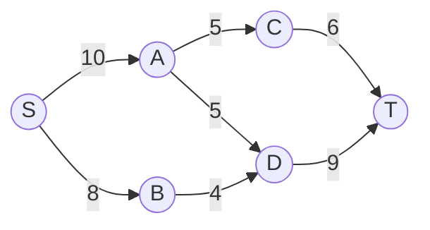
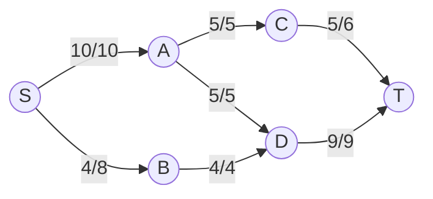

## Max flow

A flow network is a directed graph with a source node and a sink node (s and t) where each edge has a capacity c.

The max flow problem asks what is the maximum amount of flow (the amount of outflow from the source) that the network can support. 

More specifically, a flow assigns each edge a value less than its capacity, where (excluding the source and sink) the amount of flow coming into each node is equal to the amount of flow coming out of each node.

## Applications

## Algorithm to compute max flow

The main algorithm used to compute max flow is Dinic's algorithm.