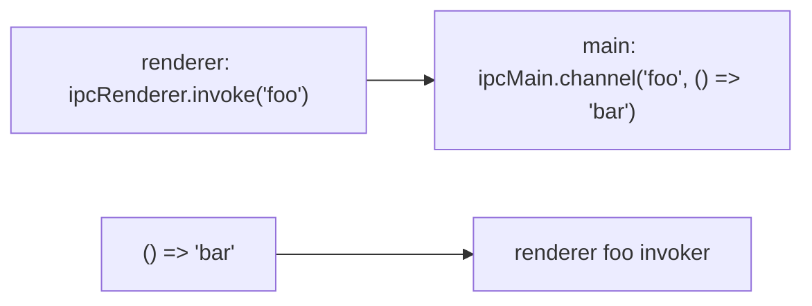

To start an app, we run the electron executable:
`electron .` (can be replaced with a path)

The entry point is `main.js`.

Here is the basic lifecycle:

```javascript
const { app, BrowserWindow } = require('electron');

const createWindow = () => {
	const win = new BrowserWindow({
		width: 800,
		height: 600
	})
	
	win.loadFile('index.html');
};

app.whenReady().then(() => {
  createWindow();
});
```

## Frontend and Desktop Interface

The electron app can obtain access to privileged OS operations, and the frontend (the **renderer** process, normally written in another framework in isolation) generally cannot.

We can expose OS operations to frontend logic through preload scripts, which are injected before a renderer loads. We use the `contextBridge` API to facilitate communication between the renderer and main electron process. The `contextBridge` can expose global variables and functions to the renderer process which can be seen in the following sections.

### contextBridge basic usage

Here is how to use and create a preload script:

```javascript
// preload.js
const { contextBridge } = require('electron') // import the contextBridge API

  
contextBridge.exposeInMainWorld('versions', {  
	node: () => process.versions.node,  
	chrome: () => process.versions.chrome,  
	electron: () => process.versions.electron  
	
	// we can also expose variables, not just functions  
})
```

This script exposes the variable `versions` in the renderer, and it takes the value of a js object with the 3 keys and 3 functions (returning the values).

In the main process we have:

```js
const { app, BrowserWindow } = require('electron')

// added path library
const path = require('node:path')

const createWindow = () => {
    const win = new BrowserWindow({
        width: 800,
        height: 600,
        // injecting the preload script
        webPreferences: {
            preload: path.join(__dirname, "preload.js")
        }
    })

    win.loadFile('index.html')
};

app.whenReady().then(() => {
    createWindow()
});
```

Then in the renderer process the javascript runtime now has access to the global variable `versions`. (This can be accessed with either `window.versions` or simply `versions`).

(Assuming the index.html file has the necessary changes), we can add this to the renderer script to display versions (not normally accessible to the frontend logic) like the following:

```js
const info = document.getElementById("info");
info.innerHTML = `This app is using Chrome (v${versions.chrome()}), Node.js (v${versions.node()}), and Electron (v${versions.electron()})`;
```

### IPC between the renderer and main process

We use `ipcRenderer` and `ipcMain` to facilitate communication between main and renderer. ipcMain lives in the main process, and can handle invocations from the renderer and send information back. ipcRenderer lives in the renderer process (exposed through contextBridge) and can invoke channels to send information to main (the main process listens for invocations of this channels and has a callback to send information back).

This is done with:


```js
// preload.js
const { contextBridge, ipcRenderer } = require('electron') // import the contextBridge API

  
contextBridge.exposeInMainWorld('versions', {  
	node: () => process.versions.node,  
	chrome: () => process.versions.chrome,  
	electron: () => process.versions.electron,
	ping: () => ipcRenderer.invoke('ping')
	
	// we can also expose variables, not just functions  
})
```

```js
const { app, BrowserWindow, ipcMain } = require('electron/main')

const path = require('node:path')

const createWindow = () => {
  const win = new BrowserWindow({
    width: 800,
    height: 600,
    webPreferences: {
      preload: path.join(__dirname, 'preload.js')
    }
  })
  win.loadFile('index.html')
}
app.whenReady().then(() => {
  // create a handler for `ping` invocations
  // returns pong when invoked
  ipcMain.handle('ping', () => 'pong') 
  createWindow()
})
```

```js
// renderer.js
const func = async () => {
  const response = await window.versions.ping() // versions is the object exposed through contextBridge in the preload
  console.log(response) // prints out 'pong'
}

func()
```

## Window Customization

### Title Bar

Remove the default electron title bar (and the ugly application menu) by passing in `titleBarStyle: "hidden"` to the BrowserWindow constructor:

```js
const win = new BrowserWindow({
	width: 800,
	height: 600,
	titleBarStyle: 'hidden', // hide title bar
	...(process.platform !== 'darwin' ? { titleBarOverlay: true } : {}), // bring back window controls for linux and windows
	webPreferences: {
		preload: path.join(__dirname, "preload.js")
	}
})
```

After this, we need to create a custom title bar in the frontend.

### using the default os titlebar (without the menu)

By default, electron apps have an application menu. We can disable it to use default OS native title bars. First we import it, then we disable the menu after the callback for `whenReady` fires:

```js
// ... 
const { Menu } = require('electron'); // can import multiple things
//...

app.whenReady().then(() => {
    Menu.setApplicationMenu(null);
    createWindow();
    // ...
});
// ...
```
